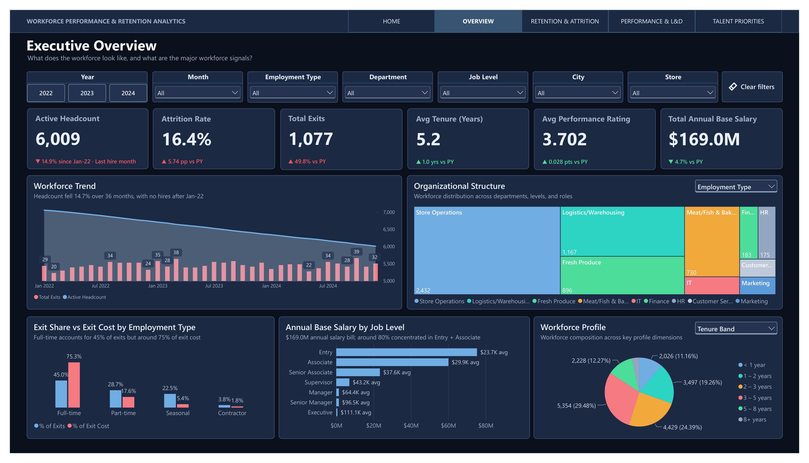

# 👥 Workforce Performance & Retention Analytics

An end-to-end workforce analytics project built with **SQL, DuckDB, and Power BI** to analyze workforce performance, employee attrition, training exposure, retention patterns, and workforce investment signals.

The project transforms monthly employee data into an analytical workforce model, applies DAX-based measures and segmentation to examine workforce patterns, and presents the findings through an interactive Power BI dashboard for workforce monitoring and decision support.

---

## 📊 Project Snapshot

|                     |                                                                   |
| ------------------- | ----------------------------------------------------------------- |
| **Domain**          | Human Resources / Workforce Analytics                             |
| **Dataset Scale**   | 7K+ Employees · 6K+ Active Employees · 236K+ Employee-Month Records |
| **Analysis Period** | Jan 2022 – Dec 2024                                               |
| **Database**        | DuckDB                                                            |
| **Tools**           | SQL · DuckDB · Power BI                                           |
| **Focus**           | Workforce Analytics · Attrition · Performance · L&D              |

---

## 📈 Dashboard Preview

🔗 [View the live dashboard](https://app.powerbi.com/view?r=eyJrIjoiYTk1NDNjOGQtNmYxNy00ZTIwLWExZWYtMmE4NTkwNTU5Y2UxIiwidCI6ImFmMWYzNzUzLTM5MjUtNGU2Zi05NDliLTk3YzAwNzMyMDgwMyIsImMiOjEwfQ%3D%3D&pageName=00nav)



---

## 🎯 Business Context

The organization experienced a **shrinking workforce and limited replacement hiring during the observation period**, making workforce stability and resource allocation increasingly important.

At the same time, attrition was not evenly distributed across employee groups, while training exposure, performance, career progression, and compensation positioning varied across the workforce.

This project addresses four core workforce questions:

- **How is the workforce evolving, and where are the key workforce trends?**
- **Where is attrition concentrated, who is leaving, and what is the associated workforce and compensation exposure?**
- **How are performance, training exposure, and career progression related?**
- **Which workforce segments and employees warrant further HR attention based on multiple evidence signals?**

---

## 💡 Key Insights

### 📉 Workforce Contraction & Attrition

The workforce contracted substantially during the observation period while attrition increased.

- Headcount declined approximately **15% from Jan 2022 to Dec 2024**, while no replacement hiring was recorded after Jan 2022.
- **1,077 exit records** were observed over the 36-month period.
- Annual attrition increased from **4.9% in 2022 to 5.7% in 2023 and 5.8% in 2024**, an approximately **18% relative increase** from 2022 to 2024.
- **Employment type** showed the strongest attrition variation among the workforce dimensions analyzed, with a **50.5 pp spread** versus **3.2 pp across departments**.

### 💰 Attrition Volume vs Financial Exposure

Exit volume and compensation exposure were not proportional across employment types.

- Full-time employees represented approximately **45% of exits** but accounted for **75.3% of cumulative exit-related people cost**.
- This highlights why attrition should be evaluated not only by exit volume, but also by the employee population and compensation exposure associated with those exits.

> *Exit-related people cost represents cumulative compensation-related amounts associated with employees who subsequently exited; it is not an estimate of replacement or productivity cost.*

### 📈 Performance & Tenure

Overall performance improved during the observation period, but the improvement weakened substantially after controlling for tenure.

- Average performance rating increased from **3.626 to 3.762** between 2022 and 2024.
- Among employees with **3–5 years of tenure**, average rating remained nearly flat at **3.740 → 3.755**.
- This suggests that part of the overall performance improvement is associated with changes in workforce tenure mix rather than broad-based within-tenure improvement.

### 🎓 Training Exposure & Performance

Training exposure was concentrated at relatively low levels, while stronger observed training–performance gradients appeared among more-tenured employees.

- Approximately **98% of active employees averaged below 6 hours of training per month**, while around **76% averaged below 3 hours in R12 2024**.
- Newer employees received the highest training exposure at approximately **4.66 hours/month**, compared with around **2.7 hours** among employees with 1+ years of tenure.
- Within tenure bands, the largest observed rating step-up occurred at **6–8 hours/month (+0.217 rating points)**, while the next step at 9–13 hours was smaller (**+0.088 points**).

These findings indicate an **allocation mismatch worth investigating**, without assuming that training directly causes performance improvement.

### 🧩 Workforce Segmentation

Performance and satisfaction reveal distinct workforce segments with different retention and development signals.

- **79.5% of active employees** fall into performance–satisfaction aligned segments, while 20.5% fall into cross-quadrant segments.
- **Retain & Protect** combines the lowest observed attrition with the highest training and promotion exposure.
- **Develop & Support** shows higher observed attrition alongside lower training and promotion exposure.
- Approximately **89% of active high performers had no recorded promotion during the observation window**, highlighting limited recorded career progression within this population.

### 💼 High-Performer Pay Exposure

Pay position shows different attrition patterns depending on the employee population being analyzed.

- In the general workforce, pay position shows little attrition variation once employment type is held constant.
- Among **high performers**, employees in the bottom pay quartile show materially higher historical attrition (**16.5%**) than high performers in Q2–Q4 (**5.8–7.7%**).
- This pattern provides the analytical basis for the **High-Performer Pay Exposure** signal on the Workforce Investment Priorities page.

---

## 🔎 Analytical Rigor & Limitations

Several intuitive relationships were tested rather than assumed.

- No measurable relationship was found between employee performance and available business outcomes such as **sales attainment, customer satisfaction, or NPS**.
- Store- and manager-level differences were too small or inconsistent to support reliable performance league tables.
- Pay-position differences in the general workforce did not show a consistent attrition pattern after accounting for employment type, while a distinct pattern remained among high performers.
- **Training ROI was not estimated in dollars** because the dataset contains no training-cost field.
- Highly redundant variables were excluded from the analysis, including a **Productivity Index that was effectively a transformation of Rating**.
- Satisfaction and Engagement were strongly correlated (**r ≈ 0.85**), so both were not treated as independent signals in downstream prioritization.

These checks helped keep the dashboard focused on **signals supported by the available data**, rather than forcing every available HR field into the analysis.

---

## 🚀 From Analysis to Workforce Priorities

The dashboard follows a four-stage analytical flow:

**Understand → Diagnose → Segment → Prioritize**

It moves from workforce structure and retention trends to performance and L&D analysis, then combines **Performance × Satisfaction** segmentation with additional evidence signals such as promotion history, training exposure, pay position, high-performer status, and historical attrition.

### Workforce Segmentation

| Workforce Segment       | Definition                           |
| ----------------------- | ------------------------------------ |
| **Retain & Protect**    | High Performance · High Satisfaction |
| **Retention Focus**     | High Performance · Low Satisfaction  |
| **Intervention Needed** | Low Performance · Low Satisfaction   |
| **Develop & Support**   | Low Performance · High Satisfaction  |

The segmentation is used as a **decision-support framework**, not as a prediction of future employee behavior.

The final **Priority Action List** identifies employees with multiple evidence signals for further HR review, while avoiding a black-box priority score.

---

## 🛠 Technical Highlights

- **Built an end-to-end workforce analytics pipeline** using DuckDB, SQL, and Power BI, transforming raw workforce data into an interactive analytical solution.

- **Profiled, cleaned, and transformed workforce data** across employee, organizational, store, performance, training, compensation, and monthly workforce datasets using reusable SQL transformations in DuckDB.

- **Designed a dimensional workforce model at employee-month grain**, building a **236K+ employee-month fact table** covering Jan 2022 – Dec 2024 and connecting employee and date dimensions to support longitudinal analysis and point-in-time workforce snapshots.

- **Engineered reusable DAX measures and analytical logic** covering headcount, attrition, exits, tenure, performance, training exposure, promotion history, compensation positioning, High Performer classification, workforce segmentation, and HR evidence flags.

- **Defined and validated consistent business metrics** across the analytical model, including active workforce logic, attrition denominators, historical versus point-in-time metrics, and reconciliation checks across employee status, monthly records, exits, and workforce counts.

- **Designed an interactive five-page Power BI dashboard** connecting Workforce Overview, Retention & Attrition, Performance & L&D, Workforce Investment Priorities, and Employee Detail drill-through into a single decision-support workflow.

---

## 📂 Project Structure

```text
workforce-performance-retention-analytics/
│
├── assets/
│   ├── dashboard_overview.png       # Dashboard preview shown in README
│   └── data_model.png               # Analytical data model
│
├── data/
│   ├── raw/                         # Original workforce datasets
│   └── processed/                   # Processed datasets used for analysis
│
├── database/
│   └── hr_analytics.duckdb          # DuckDB analytical database
│
├── sql/                             # SQL scripts for data preparation
│   ├── 01_ingest_profile.sql
│   ├── 02_clean_validate.sql
│   ├── 03_build_model.sql
│   └── 04_export_validate.sql
│
├── powerbi/
│   ├── workforce_dashboard.pbix     # Power BI report
│   └── workforce_dashboard.pdf      # Exported dashboard preview
│
├── .gitignore
├── LICENSE
└── README.md
```
